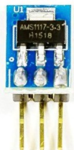
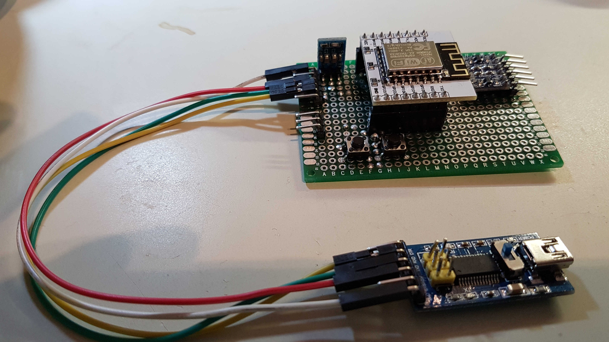
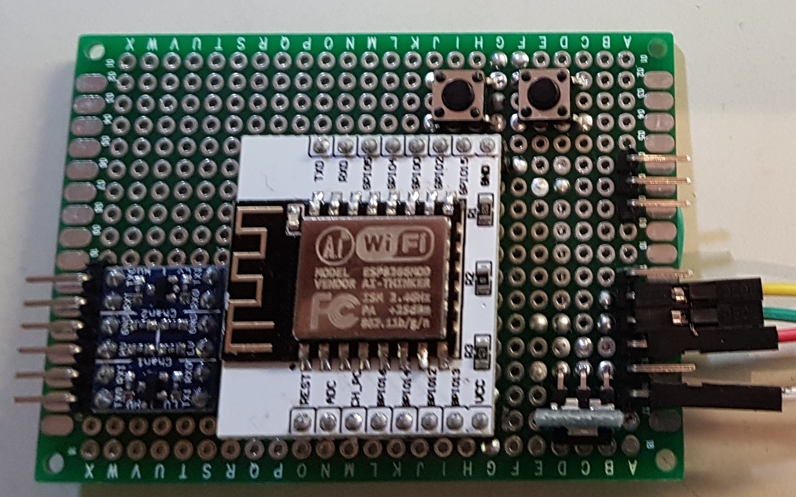

# ESP8266 Controller for WS2812b LED Strips

## Material

### ESP8266 / ESP12F

### Eastern Computer ca-5 FT232RL FTDI Micro USB to Serial Converter

* Amazon: https://www.amazon.de/gp/product/B00QCCPCNK

### 3.3V Voltage Regulator Step-Down

* Amazon: https://www.amazon.de/gp/product/B01N2UQH5P

### Logic Level Converter

* Amazon: https://www.amazon.de/gp/product/B01B3KY6Q4

## Development Build

See http://www.xess.com/blog/esp8266-reflash/ for a dev board setup.

## Final Build

* Controller module without the ESP board

* Controller module with the ESP board

* Bottom side of the controller module
